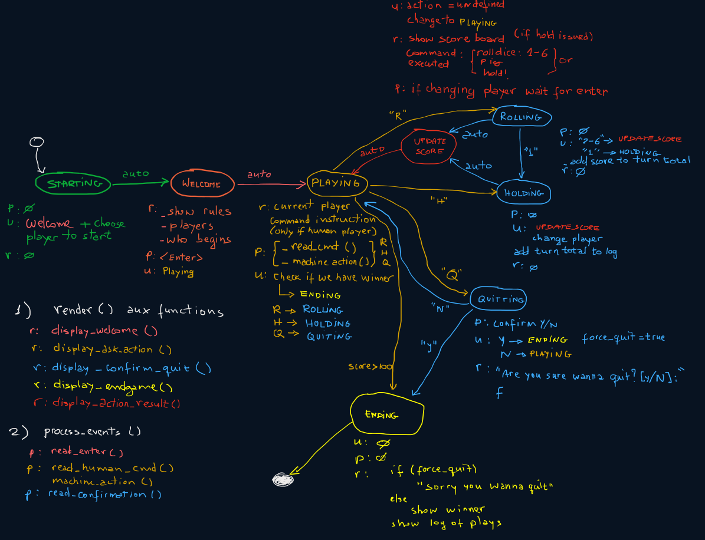

# Programming Assignment: Pig Dice

### Table of Contents
1. [Introduction](#introduction)
2. [Gameplay](#the-gameplay)
3. [Interface and Execution](#interface-and-execution)
4. [System Modeling](#system-modeling)
5. [Assignment Grading](#assignment-grading)
6. [Authorship and Collaboration Policy](#authorship-and-collaboration-policy)
7. [Work Submission](#work-submission)

# Introduction

This programming project implements a simple clone of the popular game **Pass the Pig**&copy; and **PigMania**&copy;.

The main objective with this assignment is to introduce Object Oriented Modeling with classes, separate compiling, progressive programming (small versions towards the final full-fledged program), as well as to provide an opportunity to develop a project using the tools already taught such as `cmake`, `git`, `gdb` or `lldb`, and `doxygen`.


# The Gameplay

Pig is a folk jeopardy dice game described by John Scarne in 1945, in which two players compete to reach **100 points** first.

The game is organized in turns. Each turn, the same player keeps rolling the dice, while the face points are accumulated into a __turn total__, until one of these two conditions happen:

1. The current player decides to _hold_, in which case s/he scores the **turn total**; or,
2. The face  &#9856;, (the pig) is rolled, in which case the current player scores nothing.

In both cases, the **turn total** is set to zero and it becomes the opponent's turn.

In summary, any time during a player's turn, s/he must take one of these two *actions*:

* **Roll** the dice, which may produce:
    - Face &#9856;: the player scores nothing and it becomes the opponent's turn;
    - Faces &#9857;, &#9858;, &#9859;, &#9860;, or &#9861;: the face point is added to the **turn total** and the player's turn continues.
* **Hold**
    - The _turn total_ is added to the player's overall score and it becomes the opponent's turn.

The player who scores **100** or more points at the end of a turn is the winner.

# Interface and Execution

In this version of the game there is only two players: the **machine** and the **human** player. The machine player is a piece of code you have to implement and should be able to choose one of two actions, _roll_ or _hold_, based on the current game situation. Don't worry about creating a "highly" intelligent machine player; you could just make it randomly choose between the two possible actions, for instance.

To allow the human player interaction, you program should provide an user interface asking for the player's decision, which might be _roll_, _hold_, or _quit_ the current match.

The first action of the game, even before the user interaction begins, is to choose who is going to start a match, the human or the machine. This should be done randomly (user your class `Dice`!).

After deciding who is the first to start the game your program should display the game rules. The suggested user interface is the following:

```
                      ---> Welcome to the Pig Dice game (v 1.1) <---
                             -copyright DIMAp/UFRN 2022-

  The object of the jeopardy dice game Pig is to be the first player to reach 100 points.
  Each player's turn consists of repeatedly rolling a die. After each roll, the player is
  faced with two choices: roll again, or hold (decline to roll again).
        • If the player rolls a 1, the player scores nothing and it becomes the opponent's turn.
        • If the player rolls a number other than 1, the number is added to the player's turn
          total and the player's turn continues.
        • If the player holds, the turn total, the sum of the rolls during the turn, is added
          to the player's score, and it becomes the opponent's turn.

>>> The players of the game are: "Human" & "Machine"

>>> The player who will start the game is "Human"
    Press <Enter> to start the match.
```

## Human Interaction

For the human interface, the game must list the action options and wait for the human input. Here is the suggested user interface for that:

```
-------------------------------------------------------
>>> The current player is: Human 

Commands syntax:
  <Enter>       -> ROLL the dice.
  'r' + <Enter> -> ROLL the dice.
  'h' + <Enter> -> HOLD (add turn total and pass turn over).
  'q' + <Enter> -> quit the match (no winner).

Enter command >
```

After the player input the game evaluates the outcome to decide whether the turn should ended or the player plays again. Remember that if the player draws a `1` (one) s/he looses all the points of the current turn (not the match total!) and it becomes the opponent's turn to play.

In case the player chooses to hold, the **turn total** is added to the match points, and it becomes the opponent's turn to play.

For each turn, you should keep track of the number of times the dices rolled and how much points did the player get in that specific turn. This log of actions of both player is displayed at the end of the match.

Here is a partial sequence of rolls as an example.

```
-------------------------------------------------------
>>> The current player is: Human

Commands syntax:
  <Enter>       -> ROLL the dice.
  'r' + <Enter> -> ROLL the dice.
  'h' + <Enter> -> HOLD (add turn total and pass turn over).
  'q' + <Enter> -> quit the match (no winner).

Enter command > r
>>> Requested action: "Roll"
    Dice value is "⚁" (2)
    The turn total is: 10
-------------------------------------------------------
>>> The current player is: Human

Commands syntax:
  <Enter>       -> ROLL the dice.
  'r' + <Enter> -> ROLL the dice.
  'h' + <Enter> -> HOLD (add turn total and pass turn over).
  'q' + <Enter> -> quit the match (no winner).

Enter command > r
>>> Requested action: "Roll"
    Dice value is "⚃" (4)
    The turn total is: 14
-------------------------------------------------------
>>> The current player is: Human

Commands syntax:
  <Enter>       -> ROLL the dice.
  'r' + <Enter> -> ROLL the dice.
  'h' + <Enter> -> HOLD (add turn total and pass turn over).
  'q' + <Enter> -> quit the match (no winner).

Enter command > h
>>> Requested action: "Hold"
    The turn total is: 0
┌───────────────────────┐
│      Score Board      │
├───────────┬───────────┤
│      Human│         14│
│    Machine│          0│
└───────────┴───────────┘
>>> Press enter to continue...
```

After a turn is finished (either by choosing _holding_ or drawing a _pig_) the current match score should be displayed so that booth player become aware of the game status in terms of reaching the 100-points mark.

## Machine Interaction

The machine interaction is simple: the game list all the action the machine took during its turn. An example is shown next.

```
-------------------------------------------------------
>>> The current player is: Machine
>>> Requested action: "Roll"
    Dice value is "⚂" (3)
    The turn total is: 3
-------------------------------------------------------
>>> The current player is: Machine
>>> Requested action: "Roll"
    Dice value is "⚄" (5)
    The turn total is: 8
-------------------------------------------------------
>>> The current player is: Machine
>>> Requested action: "Roll"
    Dice value is "⚄" (5)
    The turn total is: 13
-------------------------------------------------------
>>> The current player is: Machine
>>> Requested action: "Roll"
    Dice value is "⚃" (4)
    The turn total is: 17
-------------------------------------------------------
>>> The current player is: Machine
>>> Requested action: "Roll"
    Dice value is "⚀" (1)
    Ops, got a Pig, holding...
    The turn total is: 0
┌───────────────────────┐
│      Score Board      │
├───────────┬───────────┤
│       Jack│         14│
│    Machine│          0│
└───────────┴───────────┘
>>> Press enter to continue...
```

The players switch turns until one of them reaches the `100`-points mark, becoming the winner of the match.
Here is the final outcome, after the match has ended.

```
-------------------------------------------------------
>>> The current player is: Machine
>>> Requested action: "Hold"
    The turn total is: 0
┌───────────────────────┐
│      Score Board      │
├───────────┬───────────┤
│       Jack│         69│
│    Machine│        107│
└───────────┴───────────┘
>>> Press enter to continue...

>>> THE WINNER IS "Machine"

[[ LOG of ACTIONS during the game ]]

Decisions taken by player "Jack":
4 dice rolls produced 14
3 dice rolls produced 0
3 dice rolls produced 0
4 dice rolls produced 13
7 dice rolls produced 0
1 dice rolls produced 3
2 dice rolls produced 9
2 dice rolls produced 0
3 dice rolls produced 8
3 dice rolls produced 11
3 dice rolls produced 11

Decisions taken by player "Machine":
5 dice rolls produced 0
6 dice rolls produced 22
1 dice rolls produced 0
5 dice rolls produced 21
3 dice rolls produced 0
2 dice rolls produced 0
4 dice rolls produced 21
5 dice rolls produced 23
1 dice rolls produced 0
4 dice rolls produced 0
7 dice rolls produced 20

    ---> [ Thanks for playing. See you next time! ] <---
```
# System Modeling

## The Game Loop Pattern

Often games are organized using the [**Game Loop Pattern**](https://www.gameprogrammingpatterns.com/game-loop.html). This is a well established way of modeling the software architecture and could be a good choice for your game.

This pattern is based on the concept of a [**Finite-State Machine** (FSM)](https://en.wikipedia.org/wiki/Finite-state_machine) in which a system (in our case, the game itself) is modeled as a set of **states**. Interactions with the system may trigger a transition from one state to another.

In our particular case, the interactions are the user input and the outcome of rolling a dice. Defining the right set of states is important task and might be somewhat difficult if you do not have previous experience in this type of modeling. For that reason I'm including here the FSM I defined for my version of the game.



Feel free to alter, include or delete any of the game states as you see fit.

The Game Loop Pattern is based on infinity loop that calls 3 important functions or methods. This is usually the coded in the `main()` function, as follows.

```c++
int main(void){
    GameController game;         // The game instance.
    game.initialize();           // Set up the game
    while(not game.game_over()){ // The Game Loop Pattern
        game.process_events();
        game.update();
        game.render();
    }
    return EXIT_SUCCESS;
}
```

+ `process_events()`: this method is responsible for receiving any user input, such as the command to _roll_  or _hold_, for instance. Of course, there exist states that do not require any user interaction; in these cases this method does nothing.
+ `update()`: this is, perhaps, the most import method or, at least, the method in which most of the programming is done. It is responsible for updating the internal state of the game (for instance, the turn total score) and for deciding if it is necessary to transition the current game state into another state.
+ `render()`: this method draws the user interface on the standard output. Usually each state requires a different output. It is important to realize that all the output commands are called through this method. This means that you should not call `std::cout` in any other part of your code but here. 


## Class Modeling

In terms of modeling the game as a set of classes, I suggest the creation of the following three entities:

+ `GameController`: This class keeps track of the list of players, the turn total score, and the match score. It is also responsible for switching turns, keep track of who is the current player, and determining when the match ends and who is the winner. Another important function of this class is to store the **game state** and provide the public interface that realizes the [**Game Loop Architecture**](https://www.gameprogrammingpatterns.com/game-loop.html). There is only one instance of this class, which is commonly known as the [**singleton pattern**](https://en.wikipedia.org/wiki/Singleton_pattern).
+ `Player`: This class stores the player name, and the log of turns that happened during a match. A turn is composed of two information: how many times the dice was rolled in a turn and what was the score of that turn. In terms of actions (methods), this must provide methods to retrieve the player's score and log. But the most important method is the `next_action()` which should return a code for either _hold_, _roll_, or _quit_ (in the case of the human player). The machine player chooses this action based on its AI (artificial intelligence), whereas the human player reads this decision from the user. Obviously, your game should instantiate two objects of this class.
+ `Dice`: It is a simple class the simulates a digital dice. It is designed to randomly choose an integer number between `1` and `6` with an uniform distribution.

# Assignment Grading

This assignment has a total of **100 points**. Bellow is a table with the description of the item under consideration and the assigned grade _if the item is totally correct_. Partial grade will be considered if the item is not fully correct.

Item     | Value (points)
-------- | :-----:
Shows the game rules | 5
Randomly chooses the player who starts the match | 5
Program runs correctly, alternating turns between players | 10
Keeps the correct values of the turn total    | 10
Display the plays/outcomes of the human as requested in this document | 10
Display the plays/outcomes of the machine as requested in this document | 10
Show the match's partial score | 10
Show the action log at the end of a match | 10
Identify the winner correctly | 10
Created at least two classes | 10
Program handles errors properly | 10

The following situations may take credits out of your assignment, if they happen during the evaluation process:

Item     | Value (points)
-------- | :-----:
Compiling and/or runtime errors  | -5
Missing code documentation in Doxygen style | -10
Memory leak | -10
[`author.md`](author.md) file not filled out | -10

The [`author.md`](author.md) file should contain a brief description of the project, and how to run it. It also should describe possible errors, limitations, or issues found. Do not forget to include the author name!

# Authorship and Collaboration Policy

This is an **individual assignment**. You may be called for an interview. The purpose of the interview is to confirm the authorship of the assignment and to ask for explanations on specific points of the code. During the interview, you should be capable of explaining any piece of code. After the interview, the assignment’s credits may be reviewed.

The cooperation among students is strongly encouraged. It is accepted the open discussion of ideas or development strategies. Notice, however, that this type of interaction should not be understood as a free permission to copy and use somebody else’s code. This is may be interpreted as plagiarism.

Any two (or more) programs deemed as plagiarism will automatically receive no credits, regardless of the real authorship of the programs involved in the case. If your project uses a (small) piece of code from someone else’s, please provide proper acknowledgment in the [`author.md`](author.md) file.

# Work Submission

You may submit your work in two possible ways: via GitHub Classroom (GHC), or, via Sigaa submission task. In case you decide to send your work via GHC you _must_ also send a text file via Sigaa submission task with the github link to your repository. In case you choose to send your work via Sigaa only, send a zip file containing all the code necessary to compile and run the project.

I any of these two ways, remember to remove all the executable files (i.e. the `build` folder) from your project before handing in your work.

--------
&copy; DIMAp/UFRN 2022.
